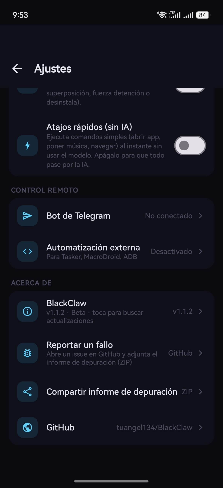
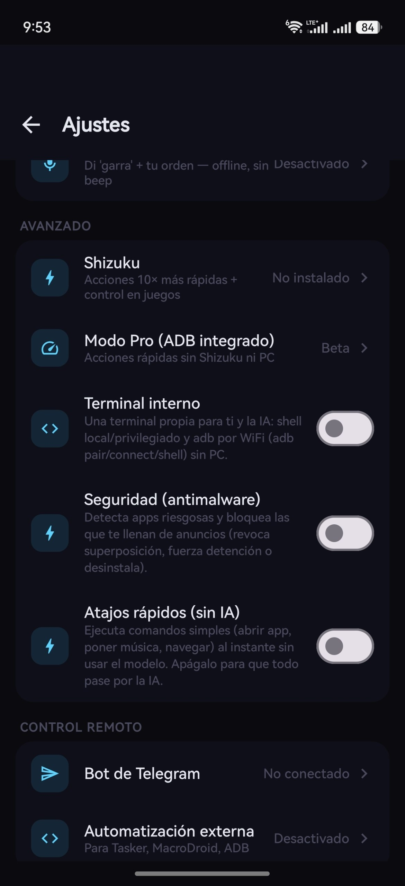
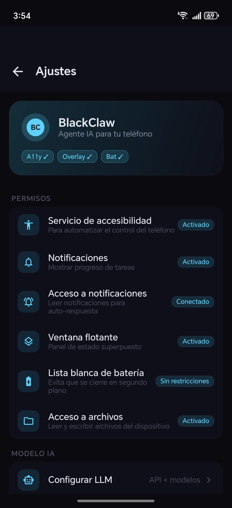
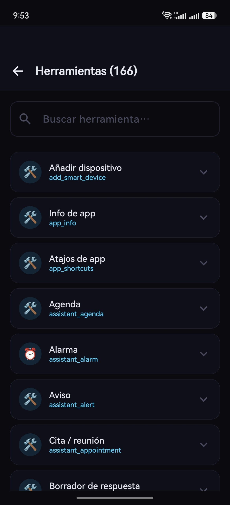
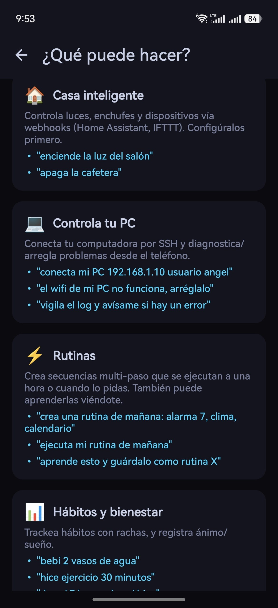
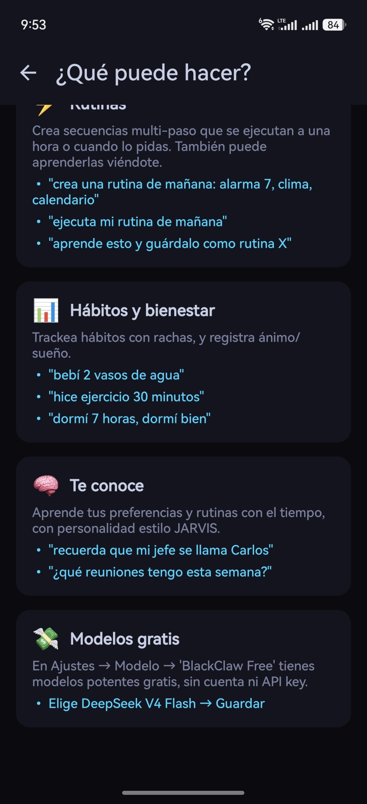
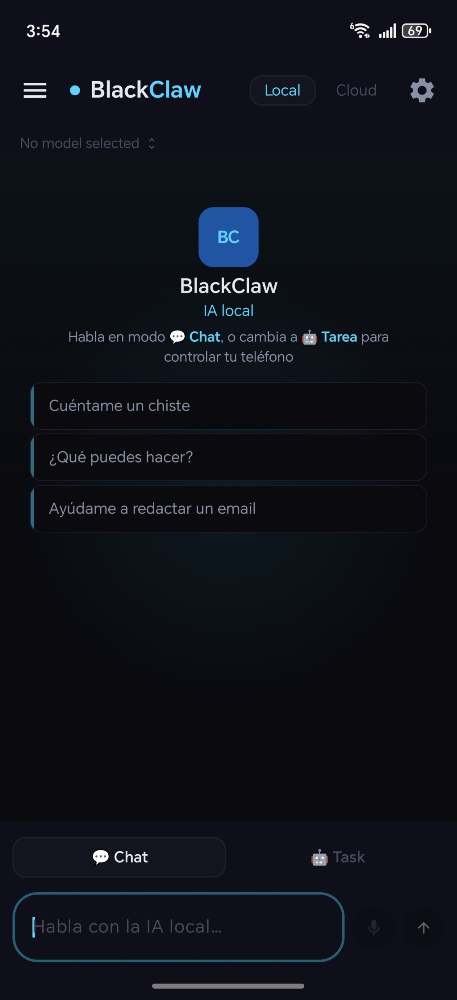

<div align="center">

# BlackClaw

**An on-device AI agent that operates your Android phone.**

BlackClaw lets a language model see the screen, decide what to do, and drive any
app end to end — taps, swipes, typing, navigation — using your own LLM, locally
or in the cloud.

[](#requirements)
[](#tech-stack)
[](https://github.com/tuangel134/BlackClaw/releases)
[](LICENSE)

### [⬇️ Download the latest APK](https://github.com/tuangel134/BlackClaw/releases/latest)

<sub>Sideload the signed APK from the Releases page. Android 9+ · ~160 MB</sub>

> ⚠️ **Beta.** BlackClaw is under active development. Expect rough edges and
> behavior that varies across OEM skins. Bug reports are very welcome — see
> [Reporting bugs](#reporting-bugs).

</div>

---

## Screenshots

<div align="center">

   
  

</div>

---

## Overview

BlackClaw turns an Android device into an AI-operated phone. A model — running
**on-device** (Gemma via LiteRT-LM) or in the **cloud** (any OpenAI-compatible
endpoint, Anthropic, Groq, etc.) — drives a generic tool layer that reads the
live accessibility tree and acts on it.

You describe a task in plain language. BlackClaw observes the screen, picks the
right tools, performs the steps, verifies the result, and reports back. It works
across any installed app because it operates the UI the same way a person does,
rather than relying on per-app integrations.

- **Local-first.** On-device inference needs no account and no API key. Your
  screen content and messages never leave the phone.
- **Cloud-optional.** Bring your own key for a frontier model when you want more
  reasoning power. The key is stored only in local app storage.
- **Hands-free voice.** A wake word ("garra"/"BlackClaw") and an offline speech
  engine let you talk to it; set BlackClaw as the phone's assistant and invoke it
  with the power button — even over the lock screen — with a full-screen animated
  panel that streams the answer and speaks it back.
- **Fast app control.** 70+ popular apps (Uber, Uber Eats, Spotify, Maps,
  WhatsApp, Amazon…) are driven straight to the right screen via deep links, and
  a deterministic fast-path runs common commands instantly with zero LLM calls.
- **Android Auto.** A voice-first, driving-safe surface on the car head unit:
  one-tap actions (navigate, play music, call, notifications) plus a "Preguntar"
  search that uses the car's own speech-to-text — answers read aloud.
- **Remote-controllable.** Drive the phone by messaging it from Telegram,
  Discord, or WeChat — useful for an agent that runs while the device is away.
- **Broad reach.** 110+ built-in tools spanning UI control, device settings,
  messaging, files, network, perception, and automation.

---

## What you can ask it

Plain-language examples — BlackClaw figures out the steps:

- *"Open WhatsApp and tell Mom I'll be 20 minutes late."*
- *"Check my notifications and summarize anything important."*
- *"How much battery do I have, and turn on battery saver if it's under 20%."*
- *"Order me an Uber to the airport."* / *"Play Bad Bunny."* / *"Take me to the nearest Walmart."*
- *"I have a meeting at 7"* → sets an alarm, adds it to your calendar and agenda.
- *"Search YouTube for lo-fi beats and play the first result."*
- *"Read the text on screen and tap the Continue button"* (works in games via OCR).
- *"Every weekday at 8am, read me the weather out loud."* (scheduled task).
- *"Watch for messages from my boss and auto-reply that I'm in a meeting."*
- *"What does my clipboard say, and translate it to English."*

If a request is just a question or a chat, BlackClaw answers in text without
touching the phone.

---

## Tools at a glance

| Category | Examples |
|---|---|
| **UI control** | tap · long-press · swipe · pinch · drag-and-drop · path trace · type · scroll-to-find |
| **Navigation** | open app · switch app · back/home/recents · find & tap by text |
| **App shortcuts** | deep-link 70+ apps (Uber · Uber Eats · Spotify · Maps · Amazon…) · play music in any player · discover installed-app actions |
| **Voice** | wake word · offline STT (Vosk) · system-assistant panel · streaming TTS · continuous conversation |
| **Android Auto** | voice-first car surface · one-tap navigate/music/call/notifications · car speech-to-text · answers read aloud |
| **Privileged (ADB/Shizuku)** | fast tap/swipe in games · force-stop · arbitrary shell · burst tap |
| **Perception** | read screen (accessibility tree) · OCR over screen capture · screenshot |
| **Device** | battery · memory · network · volume · brightness · WiFi/BT/flashlight toggles |
| **Comms** | send message (WhatsApp/Telegram/…) · SMS · calls · contacts · notifications |
| **Personal data** | calendar · call log · clipboard |
| **Web & data** | web search · fetch URL · weather · translate · currency/unit convert · QR · hash · JSON/regex |
| **Files & memory** | read/write files · long-term facts · shared knowledge base |
| **Assistant hub** | reminders · alarms · notes · calendar · alerts · finances (native, push) |
| **Automation** | cron-style scheduled tasks · multi-step plan execution · external API (Tasker/ADB) |
| **Terminal** | persistent internal shell (local/privileged) · adb-over-wifi to remote devices (pair/connect/shell) without a PC |
| **Security** | app risk scanner · real-time ad attribution · neutralize/block/disable/uninstall problem apps |

---

## Features

### Phone control
- Reads the live accessibility tree and computes element coordinates
- Tap, long-press, swipe, pinch, drag-and-drop, multi-point path tracing
- Type into any field, scroll-to-find, open and switch apps
- Handles popups, permission dialogs, and paywalls intelligently

### Voice & system assistant
- **Hands-free wake word** ("garra" or "BlackClaw") with an **offline** speech
  engine (Vosk) — no internet, no key. Fuzzy matching tuned for how the
  recognizer mishears the word.
- **Set BlackClaw as the phone's assistant** and summon it with the power-button
  gesture — it appears in a **full-screen animated panel** (an audio-reactive
  claw orb) **even over the lock screen**, like Gemini/Assistant.
- **Streaming replies:** the answer types out live and is **spoken sentence by
  sentence as it generates** (cloud models); tap the orb to interrupt.
- **Continuous conversation:** it re-listens after answering so you can go back
  and forth without repeating the wake word. Rich answers render **links and
  images inline**. Suggestion chips hint what to say.
- Whisper mode (Alexa-style), voice activity detection, and phone-call mic
  handling so it yields the microphone during calls.

### Android Auto
- A **voice-first, driving-safe** surface built on the **Android for Cars App
  Library**. When the phone is connected to Android Auto, BlackClaw shows a grid
  of large one-tap actions on the car screen: **Preguntar** (ask anything),
  **Navegar**, **Música**, **Llamar** and **Notificaciones**.
- The action screens use a **search template**, so the **car's own
  speech-to-text** transcribes what you say — you never touch the phone. The
  transcribed request runs through the same task pipeline as the phone (deep-link
  fast-path, tools, agent loop) and the answer is **read aloud** with TTS.
- Because it reuses the full pipeline, anything BlackClaw can do by voice on the
  phone also works from the car.
- Distributed as a sideload app (not on Play), so to use it you enable **"Unknown
  sources"** for developer apps in the Android Auto settings on the phone.

### App control via deep links
- **70+ popular apps** open straight to the useful screen via deep links —
  ride-hailing (Uber, DiDi, Cabify, Lyft, Bolt), food (Uber Eats, Rappi,
  DoorDash, Glovo), music, maps, shopping (Amazon, Mercado Libre, AliExpress),
  streaming, social, travel and more — far faster than tapping through the UI.
- **Play music in any player** via Android's universal play-from-search
  (Spotify, YouTube Music, Musicolet, Poweramp…), with a preferred-player setting.
- **Auto-discovery:** BlackClaw asks the system which installed apps can handle
  each capability (music, navigation, email, calling…), so it adapts to *your*
  app set instead of a hardcoded list.
- **Deterministic fast-path:** common commands ("open X", "play Y", "navigate to
  Z", "get me an Uber") run **instantly with zero LLM calls** — toggle it in
  Settings → Advanced.

### Privileged control (no PC, no root)
- **Built-in self-ADB pairing.** BlackClaw can pair with its own `adbd` over the
  loopback interface using Android's Wireless Debugging (TLS 1.3 + SPAKE2), with
  the 6-digit code read automatically from the system dialog via accessibility.
  No computer and no second app required.
- Optional **Shizuku** backend is also supported.
- Either backend unlocks shell-level actions: ultra-fast taps/swipes that work
  inside games and `SurfaceView`, real `force-stop`, and arbitrary shell commands.

### Perception
- On-device OCR (ML Kit) over a `MediaProjection` screen capture, so the agent
  can read and tap text in games and custom-rendered surfaces where the
  accessibility tree is empty.

### Assistant hub (native)
- A built-in **Assistant** that keeps reminders, alarms, notes, calendar
  events, alerts and **finances** inside the app — no bouncing out to the
  system Clock / Calendar / Notes apps
- **Real alarms:** full-screen ringing over the lock screen, looping sound,
  vibration, and dismiss / snooze — not just a passive notification
- Time-based items fire **native push notifications** and survive reboots
- A modern, color-coded UI (gradient header, native clock time picker, swipe-in
  access from the chat drawer) with manual add / complete / delete
- **Calendar & agenda view:** a month grid marks days with scheduled items and a
  chronological agenda lists what's coming up; tap any item to reschedule, and
  optionally overlay your **system (Google) calendar**
- **Voice appointments:** *"I have a meeting at 7"* creates one entry that shows
  on the calendar/agenda **and** rings like an alarm — now or weeks out — plus an
  optional early heads-up; conflict warnings included
- The AI manages the hub end-to-end: *"remind me to call the dentist tomorrow
  at 5"*, *"what reminders do I have?"*, *"cancel the 7am alarm"*, *"log that I
  spent 200 on food"*, *"undo that"* all read and write the native hub
- **Important alarms with challenges:** mark an alarm as critical and it won't
  dismiss until you solve a quick math, **memory** (digits shown briefly then
  hidden), or typing challenge — so you actually wake up
- **Shopping list, monthly budget, location reminders** (geofence, no constant
  GPS), **home-screen widget** and a **Quick Settings tile** showing your next item
- **Draft replies:** the assistant can draft a suggested answer to a message and
  drop it in the hub with a one-tap copy button — you stay in control of sending
- **Recurring bills & subscriptions:** monthly reminders a few days before a
  charge so you're never surprised
- **Medication reminders** (one or several daily doses) and **promise tracking**
  (*"te llamo el lunes"* → follow-up reminder)

### Proactive assistant
- Opt-in mode where **every incoming notification wakes the AI** for a cheap
  one-shot check against your natural-language instructions
- If something is time-sensitive and you didn't act, it acts for you: a night
  message saying *"be at the office at 7am"* with no alarm set → it sets the
  alarm; a deadline → it adds a reminder; a charge → it logs the expense
- You choose which autonomous actions are allowed (alarms, reminders, notes,
  calendar, finances) and which apps to watch; a log shows everything it did
- **Daily briefings** (morning / night) summarize what's ahead and suggest
  actions, optionally **read aloud via TTS** with a configurable voice
- **Weekly finance summary:** a recap of the week's spending vs your budget, top
  categories, **spending-anomaly alerts** (this week vs your 4-week average) and
  **savings-goal** progress — all computed on-device
- **Gating you control:** quiet hours, max actions per hour, "ask when unsure",
  and per-app watch lists keep it from being noisy
- **Export finances to CSV** for a backup or to open in a spreadsheet

- **New Features
Agent Core Reliability:**
- Hardened ActionGuard with anti-prompt-injection defense
- Guided permissions onboarding
- Multi-step plans verified before execution
- Implementation of TTS Voice for morning summary, evening summary.

**Learning and Memory:**
- The assistant learns from your habits and anticipates your needs
- Learns from your corrections (when you delete actions)
- Context memory across tasks
- Active learning of preferences (ignored apps)

**Auto-Correction:**
- Automatically attaches what's on screen when a plan fails
- Intelligent memory consolidation

**Visual Refinement:**
- Cleaner and clearer onboarding
- Improved suggestion cards

### Messaging & remote control
- Send messages on WhatsApp, Telegram, Discord, and more
- **Drive the phone remotely** by messaging it from a Telegram / Discord / WeChat
  bot — the agent runs tasks and replies with the result, even while the device
  is away from you
- **Auto-Replies:** dedicated profiles with free-form personality and context,
  plus the ability to import a WhatsApp chat export so a reply persona matches
  how you actually write
- Cron-style scheduled tasks via `AlarmManager`
- External automation API (Tasker / MacroDroid / ADB broadcasts)

### Models — local or cloud, your choice
- **On-device (private):** Google Gemma 4 E2B / E4B via LiteRT-LM, with optional
  **uncensored (abliterated)** Gemma 4 community ports — same architecture, so
  they load on the same runtime — downloadable from within the app. You can also
  paste a custom `.litertlm` URL.
- **Cloud (bring your own key):** OpenAI, Anthropic, Google Gemini, Groq,
  DeepSeek, Cerebras, or any OpenAI-compatible endpoint via a custom base URL
- Switch modes anytime; chat can stay local while heavy tasks use the cloud

### Reliability & safety
- **Stuck detection** breaks out of loops and re-plans instead of repeating a
  failed action
- **Action guard** refuses destructive calls (uninstall, data wipe) and never
  auto-confirms purchases, payments, or password entry
- **Token budget + rate-limit handling** keep cloud usage bounded and recover
  automatically when a provider asks you to slow down

### Productivity tools
- Device state (battery, memory, network), settings toggles, volume/brightness
- Calendar, SMS, contacts, call log

### Internal terminal
- **Persistent shell session** shared between the user and the AI — working
  directory, backend and adb connections survive across commands
- Backends: LOCAL (app-level, works always) or PRIVILEGED (Shizuku / self-paired
  ADB for `pm`, `am`, `settings`, `input`…)
- **adb-over-WiFi without a PC:** `adb pair <host:port> <code>`, `adb connect`,
  `adb shell <cmd>` — operate another device from inside BlackClaw
- Activatable toggle in Settings → Advanced

### Security (antimalware)
- **Real-time ad attribution:** the accessibility service tracks which app's
  window just interrupted you, attributing pop-up ads to their source package
- **App risk scanner:** scores all installed apps on overlay permission, hidden
  icon, accessibility service, device-admin, sideloaded origin, dangerous
  permissions, and recently-installed timing
- **Actions:** "neutralize" (revoke overlay + force-stop), disable, uninstall,
  open settings — via Shizuku/ADB when available, system UI otherwise
- Enable from Settings → Advanced → Security
- Weather, web search, translation, currency/unit conversion, QR, hashing,
  JSON/regex utilities, file read/write, and more
- Long-term memory facts and a shared knowledge base

### Experience
- Modern Jetpack Compose UI with 10 built-in themes and an animated splash
- Fully localized Spanish interface
- User-defined **Skills** (Markdown playbooks) to script repeatable flows

---

## How it works

```
┌─────────────┐   task    ┌──────────────────────┐
│   You        │─────────▶│   Agent loop          │
└─────────────┘           │  observe → think → act │
        ▲                 └───────────┬───────────┘
        │ result                      │ tool calls
        │                             ▼
┌───────┴───────┐          ┌──────────────────────┐
│  LLM           │◀────────│  Tool layer (110+)    │
│ local / cloud  │ schemas │  a11y · ADB · OCR ·   │
└───────────────┘          │  net · device · files │
                           └───────────┬───────────┘
                                       ▼
                           ┌──────────────────────┐
                           │  Android device       │
                           │  (any installed app)  │
                           └──────────────────────┘
```

Each round the agent reads the screen, reasons about the next step, and calls a
tool. Action results carry a fresh screen snapshot so the model can decide the
next move without a wasted round.

### Token-efficient tool disclosure

Sending ~110 full tool schemas on every request is expensive and trips cloud rate
limits. BlackClaw uses **progressive disclosure**: a compact one-line catalog of
every tool is shown in the system prompt, a task-relevant subset is preloaded
with full schemas, and the model loads anything else on demand via a
`request_tool` meta-tool. The model always sees the full catalog — it never loses
awareness of a capability — while a typical request stays small. Rate-limit
responses are honored automatically (the agent waits the time the provider asks
for and retries).

---

## Requirements

- Android 9+ (API 28)
- ~4 GB RAM minimum for the local Gemma E2B model (E4B for 10 GB+ devices)
- Permissions granted once in-app: Accessibility, Notification access, Overlay,
  and battery whitelist
- Cloud mode: your own API key for OpenAI / Anthropic / Google Gemini / Groq /
  DeepSeek / Cerebras, or any OpenAI-compatible endpoint

---

## Building

Debug build:

```bash
./gradlew assembleDebug
```

The APK lands in `app/build/outputs/apk/debug/`.

Release builds require a keystore. Provide the signing values via environment
variables or `local.properties`:

```
KEYSTORE_FILE=/absolute/path/to/blackclaw-release.keystore
KEYSTORE_PASSWORD=...
KEY_ALIAS=...
KEY_PASSWORD=...
```

Then:

```bash
./gradlew assembleRelease
```

See [`RELEASING.md`](RELEASING.md) for the full release process.

---

## Project layout

```
app/
  src/main/java/com/blackclaw/android/
    adb/              Self-ADB pairing + connection (TLS 1.3 + SPAKE2) and shell
    agent/            LLM clients, agent loop, prompts, tool selection, skills
    assistant/        Native Assistant hub (reminders/alarms/notes/finance) + alarm ring
    autoreply/        Auto-reply profiles + WhatsApp export parser
    automation/       External automation API (RUN_TASK / RUN_CHAT)
    car/              Android Auto (Car App Library) — voice-first car surface
    channel/          Discord, Telegram, WeChat handlers
    floating/         Overlay floating control
    perception/       MediaProjection screen capture + ML Kit OCR
    proactive/        Proactive assistant (notification → AI → autonomous action)
    scheduler/        Cron-style scheduled tasks
    server/           NanoHTTPD LAN config server
    service/          Accessibility, notification listener, foreground services
    shizuku/          Optional Shizuku backend
    tool/             Generic tool layer (110+ tools)
    ui/               Compose UI: chat, settings, themes, skills, auto-replies, ADB
    utils/            Logging, KV storage, contact / UI matching
docs/                 Skill file specification
gradle/               Version catalog
scripts/              ADB-driven smoke and E2E harnesses
```

---

## Tech stack

- Kotlin / Java 17, Android Gradle Plugin 9.1
- Jetpack Compose (BOM 2025.05) + Material 3
- LiteRT-LM 0.10 for on-device Gemma inference
- LangChain4j for cloud OpenAI / Anthropic clients
- libadb-android + Conscrypt for the built-in ADB pairing stack
- ML Kit Text Recognition for offline OCR
- OkHttp · Retrofit · Gson · MMKV · Glide · ZXing · NanoHTTPD

---

## Privacy

In local mode, inference runs entirely on the device and no screen content,
message, or device data is sent anywhere. In cloud mode, requests go only to the
provider whose key you configured. API keys are stored in local app storage and
are never transmitted to any third party by BlackClaw.

---

## Download

Grab the latest signed APK from the
[**Releases**](https://github.com/tuangel134/BlackClaw/releases) page and
sideload it. BlackClaw is distributed as a sideload APK (not on Play Store) and
is currently in **beta**.

Two APKs are published per release:

- **`BlackClaw-vX.Y.Z-arm64-v8a.apk`** — recommended for virtually every modern
  phone (~half the size, includes the on-device LLM).
- **`BlackClaw-vX.Y.Z-universal.apk`** — fallback that runs on any architecture
  if the arm64 build won't install.

Verify your download against `SHA256SUMS.txt` with `sha256sum -c SHA256SUMS.txt`.

After installing, grant the one-time permissions the app requests
(Accessibility, Notification access, Overlay, battery whitelist). For privileged
control without a PC, follow the in-app **Pro mode** flow to pair over Wireless
Debugging.

---

## Reporting bugs

BlackClaw is in beta and OEM behavior varies, so reports are valuable.

1. In the app, open **Settings → About → Share debug report** to generate a ZIP
   (device fingerprint, ABIs, RAM, permission state, recent logs).
2. Open a new issue on
   [**GitHub Issues**](https://github.com/tuangel134/BlackClaw/issues/new) — the
   **Settings → About → Report a bug** button pre-fills one for you — and
   **attach the debug ZIP**.

## Contributing

Contributions are welcome. See [`CONTRIBUTING.md`](CONTRIBUTING.md) for setup,
PR guidelines, and conventions.

---

## Changelog

### v1.1.2

- **Fixed a crash-loop that could disable accessibility.** Any tool that
  triggers screen-capture consent (OCR/screenshot tools, used automatically
  when the accessibility tree is empty — e.g. games and other apps that render
  their own UI via SurfaceView/OpenGL) crashed the app instantly
  (`IllegalStateException: You need to use a Theme.AppCompat theme`) because
  the permission dialog's activity used a non-AppCompat theme. Repeated crashes
  killed the whole process, which took the Accessibility service down with it —
  looking like BlackClaw's accessibility permission "turned itself off".
  Confirmed fixed on-device (Honor Magic 7 Pro / MagicOS) via crash-log
  analysis (`dumpsys dropbox`) before and after.

### v1.1.1

- **Assist panel: type instead of talk.** A keyboard toggle next to the mic
  lets you switch to typing at any time — even mid-listen/think/speak — and
  submit through the exact same pipeline (tools, context, conversation memory)
  as a spoken command. Suggestion chips now rotate through a wider variety of
  capabilities (reminders, security, notifications, alarms) instead of only
  "open app X".
- **Fixed: voice input not working on some OEM ROMs** (observed on HonorOS/
  MagicOS). Root causes and fixes:
  - The system's DEFAULT speech-recognition component could fail to bind
    ("error 10"); BlackClaw now resolves and binds to a working recognizer
    (Google) explicitly instead of relying on the OEM default.
  - When Google's on-device recognizer lacks the Spanish language pack
    (error 12/13), BlackClaw now falls back to the bundled offline Vosk engine
    automatically — voice input works with zero network and zero OEM
    dependency.
  - R8/minification was silently breaking Vosk in release builds
    (`UnsatisfiedLinkError` in JNA) — added the missing ProGuard keep rules.
    This also fixes the "garra" wake word in release builds.
  - The assist panel no longer kills the mic on `onPause` (it shows over the
    lock screen, which briefly pauses/resumes during transitions).
- **Fixed: assistant panel opening the main app unexpectedly.** Any task
  started from the voice panel or the wake word previously reopened
  BlackClaw's chat screen on completion, even for plain answers ("what's on my
  agenda?"). The panel is now a self-contained surface that never redirects to
  the main app.
- **Fixed: no way to interrupt a stuck/looping task from voice.** Re-invoking
  the assist panel (power button) while a task is running now cancels it
  instead of being silently ignored, so a runaway multi-step task (e.g.
  navigation) can always be broken out of.

### v1.1.0

- **Internal terminal (Termux-like):** BlackClaw now ships its own persistent
  shell session shared between the user (new Terminal screen) and the AI (the
  `terminal` tool). Choose between LOCAL (app-level, no root) and PRIVILEGED
  (Shizuku / self-paired ADB) backends. Built-in `adb` router for connecting to
  other devices over Wireless Debugging without a PC: `adb pair`, `adb connect`,
  `adb shell`, `adb disconnect` — all from inside BlackClaw. Enable from
  Settings → Advanced → Terminal.
- **Antimalware / app security:** built-in on-device scanner that scores
  installed apps by risky traits (overlay permission, accessibility, hidden icon,
  device-admin, sideloaded origin, dangerous permission combos) and **real-time
  ad attribution** — the accessibility service tracks which app's window just
  interrupted you, so when you say "an app is spamming me with ads" the
  assistant knows who did it. Actions: revoke overlay + force-stop ("neutralize"),
  disable, uninstall. Uses ADB/Shizuku when available; falls back to opening the
  right system screen. Enable from Settings → Advanced → Security.
- **Proactive assistant improvements:**
  - Learned preferences now actually influence decisions (correction feedback +
    inline learning from each classification)
  - Pre-filter skips the LLM for notifications with no time/money/commitment cue
    (biggest efficiency win — most notifications never wake the model)
  - Classification budget (max calls/hour) protects against notification storms
  - Apps the assistant keeps ignoring get auto-muted (reversible from settings)
  - SmartQuietDetector now sees real user interaction (accessibility events), not
    just chat opens
  - Habits are SUGGESTED first, not auto-created as recurring alarms (opt-in)
- **Assistant hub performance:** in-memory cache eliminates constant JSON
  re-parsing; automatic pruning of stale alerts and old completed items
- **Rich notification extraction:** reads MessagingStyle / BigText / TextLines
  from notifications so the proactive assistant rarely needs the intrusive
  "open the chat to read" deep-read fallback
- **In-app updates from GitHub:** BlackClaw checks the repo's latest release on
  launch (and on demand from Settings → About) and, if a newer version is
  published, downloads the signed APK and launches the installer — no Play Store,
  no manual sideload. Because releases are signed with the same key, updates
  install in place.
- **Android Auto:** a voice-first, driving-safe surface on the car head unit
  built on the Car App Library — one-tap actions (Preguntar, Navegar, Música,
  Llamar, Notificaciones) that use the car's own speech-to-text and read answers
  aloud, reusing the full phone task pipeline
- **Voice & system assistant:** hands-free wake word with offline STT, set as the
  phone's default assistant, full-screen animated panel (audio-reactive claw orb)
  over the lock screen, **streaming replies** (live text + speak-as-it-generates
  on cloud models), continuous conversation, tap-to-interrupt, and rich answers
  that render links/images inline
- **App control via deep links:** ~65 popular apps opened straight to the right
  screen; play music in any player (universal play-from-search); auto-discovery
  of installed-app capabilities; **deterministic fast-path** for common commands
  (zero LLM calls) with a Settings toggle
- **Calendar & agenda view:** month + agenda, tap-to-reschedule, optional system
  calendar overlay, and voice appointments that ring like alarms and land on the
  calendar
- Redesigned home-screen **agenda widget**, fixed memory-challenge alarm,
  reinforced bilingual wake-word matching, cancel/undo, per-provider streaming,
  self-healing free-model list, and more playbooks (email, WhatsApp media,
  shopping, maps, banking, camera, device settings)
- **Reliable list selection** (`list_options`): enumerates on-screen items in
  order with tap coordinates so the agent picks the right result
- **Local (Gemma) chat streaming**: on-device chat replies now type out
  token-by-token via LiteRT-LM's async API

### v1.0.0 (beta)

First public beta. Highlights:

- On-device or cloud LLM driving 100+ tools over the accessibility tree
- **Native Assistant hub:** reminders, alarms (real full-screen ringing, with
  optional wake-up challenges), notes, calendar, alerts and finances — managed
  by the AI from chat, with a home-screen widget and Quick Settings tile
- **Proactive assistant:** notifications wake the AI to act for you, with daily
  briefings, a **weekly finance summary** (spending anomalies + savings-goal
  progress), draft replies, recurring-bill reminders, medication reminders and
  promise tracking
- Shopping list, monthly budget, location reminders (geofence), CSV finance export
- TTS briefings with a configurable voice
- Self-ADB pairing (TLS 1.3 + SPAKE2) — privileged control with no PC, no root
- On-device OCR, auto-replies with personality profiles, progressive tool
  disclosure for cloud rate limits
- **Per-ABI APKs** (arm64-v8a ~99 MB + universal fallback), signed release builds

---

## 💛 Apoya el proyecto

Si este proyecto te es útil y quieres ayudar a que siga mejorando, puedes apoyar con una donación:

**PayPal**  
[`https://paypal.me/tuangel1346`](https://paypal.me/tuangel1346)  
`tuangel1346@gmail.com`

**Criptomonedas (Bitcoin)**  
\`\`\`
bc1q5nrv64jchep3hpqptvwmume8rkw68937zftfpa
\`\`\`

Tu apoyo ayuda a mantener el desarrollo, mejorar la documentación y portar a más plataformas. ¡Gracias! 🙏

---

## License

Released under the Apache License 2.0. See [`LICENSE`](LICENSE).
